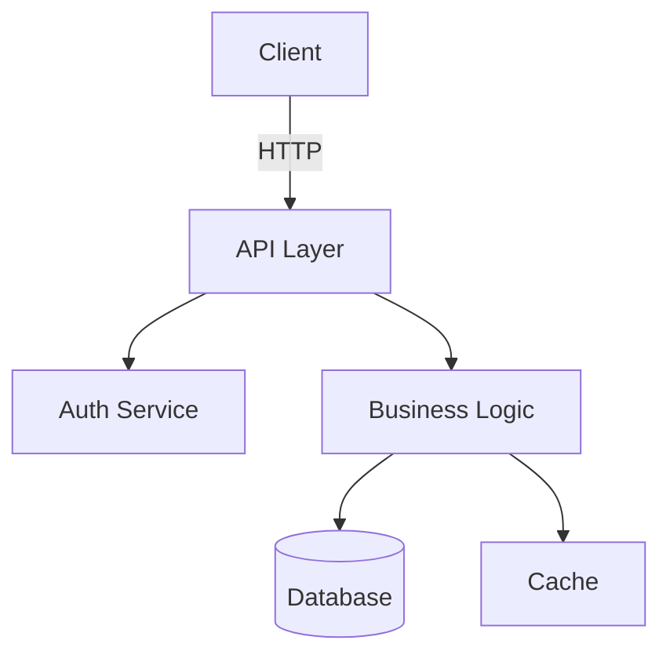

# Learn Mode Protocol

Learn mode is an autonomous documentation engine that scouts the codebase, generates/updates documentation, validates it, and fixes issues.

## Overview

Learn mode operates in 4 modes:

1. **Init** - Create documentation from scratch
2. **Update** - Refresh existing documentation after changes
3. **Check** - Read-only health check of documentation
4. **Summarize** - Quick codebase overview

## Process

### Phase 1: Scout

Map the codebase structure:

```
Repository Structure:
├── src/
│   ├── api/           [API layer]
│   ├── services/      [Business logic]
│   ├── models/        [Data models]
│   └── utils/         [Utilities]
├── tests/
├── docs/              [Existing documentation]
├── README.md
└── package.json       [Project metadata]
```

### Phase 2: Analyze

Understand key aspects:

1. **Architecture patterns**
   - MVC? Microservices? Serverless?
   - Dependency injection?
   - Event-driven?

2. **Key components**
   - Entry points
   - Core services
   - Data flows
   - External integrations

3. **Tech stack**
   - Languages
   - Frameworks
   - Databases
   - External services

4. **Documentation gaps**
   - Missing READMEs
   - Undocumented public APIs
   - Missing architecture diagrams

### Phase 3: Generate

Create documentation:

#### Init Mode Output

```markdown
# Project Documentation

## Overview
[Project description]

## Architecture
[Mermaid diagram]

## Getting Started
[Installation, setup]

## API Reference
[Auto-generated from code]

## Key Components
- Component A: [description]
- Component B: [description]

## Development Guide
[How to contribute]

## Testing
[How to run tests]

## Deployment
[Deployment process]
```

#### Update Mode Process

1. Check git diff since last doc update
2. Identify changed components
3. Update relevant documentation
4. Flag stale sections

### Phase 4: Validate

Verify documentation:

1. **Link check** - All internal links valid?
2. **Code sync** - Code examples still work?
3. **Completeness** - All public APIs documented?
4. **Freshness** - Last updated timestamps?

### Phase 5: Fix Loop

Fix documentation issues (up to 3 retries):

```
Find issue → Fix → Validate
                ↓
           Issue persists?
                ↓
          Yes → Retry (max 3)
           No → Continue
```

## Modes

### Init Mode

Create documentation from scratch.

```
$kimi-autoresearch:learn --mode init --depth deep
```

**Depth levels**:
- `shallow` - README + basic overview
- `standard` - README + architecture + API reference
- `deep` - Everything + detailed guides + diagrams

**Output**:
- `docs/README.md` - Main documentation
- `docs/ARCHITECTURE.md` - Architecture guide
- `docs/API.md` - API reference
- `docs/DEVELOPMENT.md` - Development guide

### Update Mode

Refresh documentation after changes.

```
$kimi-autoresearch:learn --mode update
```

**Process**:
1. Check `git diff` since last update
2. Identify changed files
3. Update affected documentation
4. Update "Last modified" timestamps

**Options**:
- `--file docs/API.md` - Update specific file only
- `--since 2024-01-01` - Update since date
- `--check-only` - Don't write, just report

### Check Mode

Read-only documentation health check.

```
$kimi-autoresearch:learn --mode check
```

**Checks**:
- Broken links
- Outdated code examples
- Missing API docs
- Stale content (>30 days)
- TODOs in docs

**Output**:
```json
{
  "health_score": 85,
  "issues": [
    {
      "file": "docs/API.md",
      "issue": "Missing documentation for auth.login()",
      "severity": "high"
    },
    {
      "file": "docs/README.md",
      "issue": "Code example uses deprecated API",
      "severity": "medium"
    }
  ],
  "recommendations": [
    "Update API documentation",
    "Fix code examples"
  ]
}
```

### Summarize Mode

Quick codebase overview.

```
$kimi-autoresearch:learn --mode summarize
```

**Output**:
```markdown
# Codebase Summary

## Stats
- Files: 156
- Lines of code: 12,450
- Test coverage: 78%
- Languages: TypeScript (85%), Python (10%), Shell (5%)

## Architecture
[1-paragraph summary]

## Key Directories
- `src/api/` - REST API endpoints
- `src/services/` - Business logic
- `src/models/` - Database models

## Entry Points
- `src/index.ts` - Main application
- `src/cli.ts` - CLI interface

## External Dependencies
- Express.js - Web framework
- PostgreSQL - Database
- Redis - Caching
```

## Documentation Types

### 1. README.md

Always generated/updated:

```markdown
# Project Name

## Description
One-sentence description.

## Features
- Feature 1
- Feature 2

## Installation
```bash
npm install
```

## Usage
```bash
npm start
```

## Documentation
- [Architecture](docs/ARCHITECTURE.md)
- [API Reference](docs/API.md)
- [Development](docs/DEVELOPMENT.md)
```

### 2. Architecture Diagram

Auto-generated Mermaid diagram:



### 3. API Reference

Auto-generated from code:

```markdown
## POST /api/users

Create a new user.

**Request Body**:
```json
{
  "name": "string",
  "email": "string"
}
```

**Response**:
```json
{
  "id": "string",
  "name": "string",
  "email": "string",
  "createdAt": "string"
}
```

**Errors**:
- 400 - Invalid input
- 409 - Email already exists
```

### 4. Component Documentation

For each major component:

```markdown
## AuthService

**Purpose**: Handle authentication and authorization

**Dependencies**: UserRepository, TokenService, EmailService

**Public Methods**:
- `login(email, password)` - Authenticate user
- `register(data)` - Create new user
- `verifyToken(token)` - Validate JWT

**Events**:
- `user.login` - Emitted on successful login
- `user.registered` - Emitted on registration
```

## Validation Rules

Documentation must pass these checks:

1. **Completeness**:
   - All public APIs documented
   - All major components described
   - Setup instructions present

2. **Accuracy**:
   - Code examples run without errors
   - File paths are correct
   - API signatures match code

3. **Freshness**:
   - Last updated < 30 days
   - No references to removed features
   - Version numbers current

4. **Quality**:
   - Clear, concise language
   - Proper formatting
   - No broken links

## Chaining

Learn mode can chain with other modes:

```
# Update docs after autoresearch changes
$kimi-autoresearch
Goal: Improve error handling
Iterations: 10

$kimi-autoresearch:learn --mode update
```

```
# Check docs before shipping
$kimi-autoresearch:learn --mode check
$kimi-autoresearch:ship --type code-pr
```

## Configuration

`.autoresearch-docs.json`:

```json
{
  "learn": {
    "output_dir": "docs",
    "include": ["src/**/*.ts"],
    "exclude": ["**/*.test.ts"],
    "templates": {
      "readme": "templates/README.md",
      "api": "templates/API.md"
    },
    "validation": {
      "max_age_days": 30,
      "require_examples": true,
      "check_links": true
    }
  }
}
```

## Tips

1. **Run after significant changes** - Keep docs fresh
2. **Use check mode in CI** - Prevent doc drift
3. **Customize templates** - Match your style
4. **Review generated docs** - AI helps, humans decide
5. **Include examples** - Working code > descriptions
